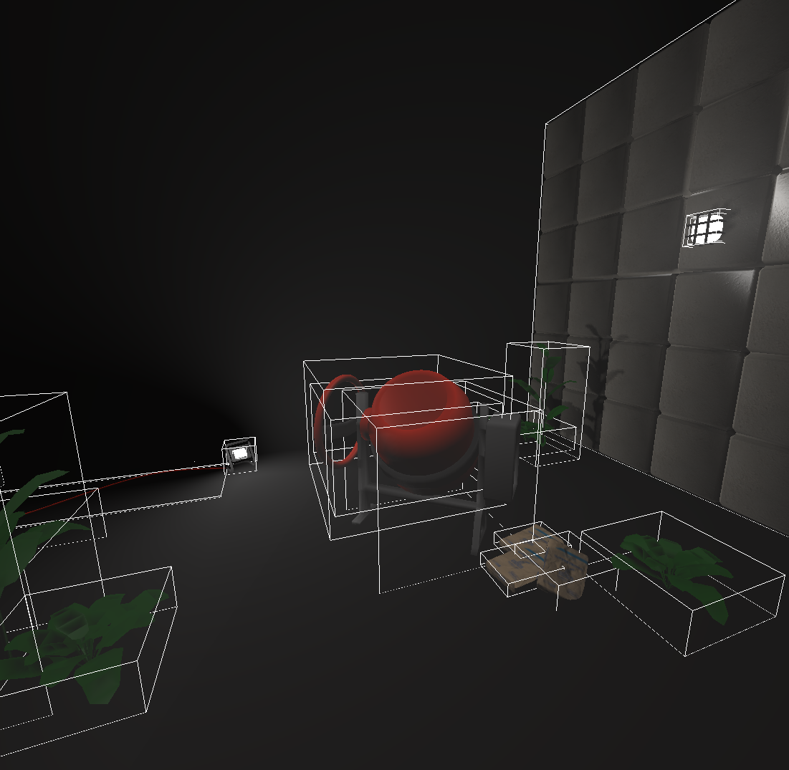

# Projet-Moteur-de-jeux-M1-IMAGINE

 

Projet réalisé en collaboration avec Louis Jean et Benjamin Serva. Ce projet porte sur la construction d'un moteur de jeux ainsi qu'un jeu pour tester le moteur. Le jeu est inspiré du jeu "Béton brutal".

<figure>      <figcaption>AABB</figcaption> </figure> 

<figure>      <figcaption>Exemple du jeu</figcaption> </figure> 

<figure>      <figcaption>Map du jeu</figcaption> </figure> 

<figure>      <figcaption>Diagramme UML</figcaption> </figure> 
